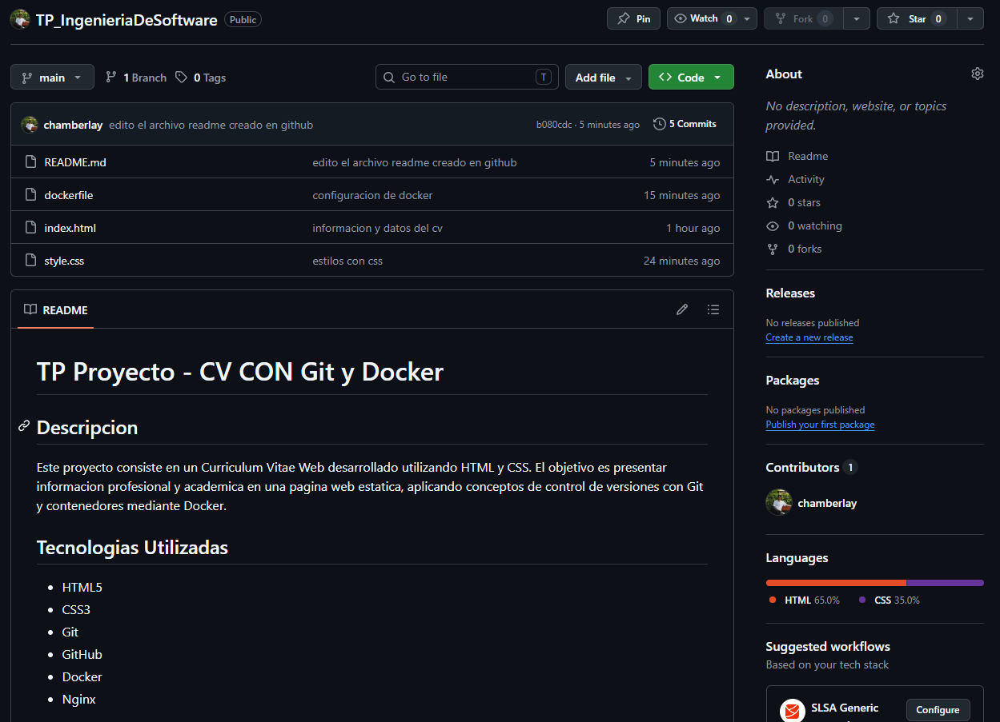
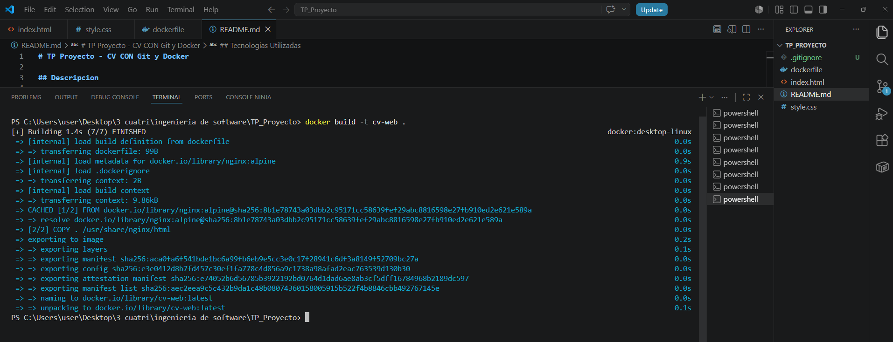
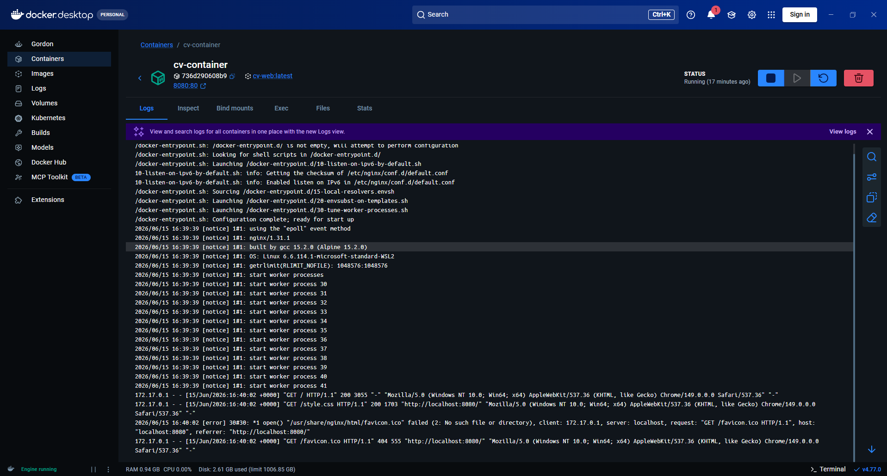
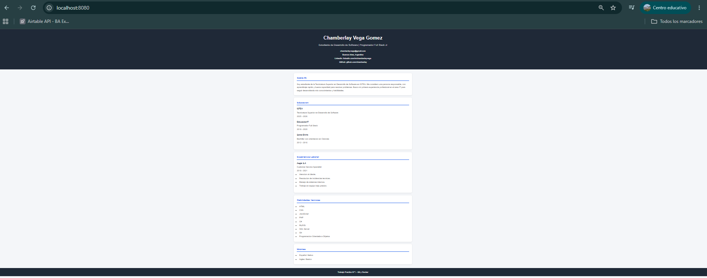

# TP Proyecto - CV CON Git y Docker

## Descripcion

Este proyecto consiste en un Curriculum Vitae Web desarrollado utilizando HTML y CSS. El objetivo es presentar informacion profesional y academica en una pagina web estatica, aplicando conceptos de control de versiones con Git y contenedores mediante Docker.

## Tecnologias Utilizadas

* HTML5
* CSS3
* Git
* GitHub
* Docker
* Nginx

## Requisitos Previos

Antes de ejecutar el proyecto es necesario tener instalado:

* Git
* Docker Desktop

## Instalacion

Clonar el repositorio:

```bash
git clone https://github.com/chamberlay/TP_IngenieriaDeSoftware.git
```

Ingresar al directorio del proyecto:

```bash
cd TP_Proyecto
```

## Construccion de la Imagen Docker

Ejecutar:

```bash
docker build -t cv-web .
```

## Ejecucion del Contenedor

Ejecutar:

```bash
docker run -d -p 8080:80 --name cv-container cv-web
```

## Acceso a la Aplicacion

Abrir en el navegador:

```
http://localhost:8080
```

## Capturas de Pantalla

### Repositorio en GitHub



### Construccion de la Imagen Docker



### Ejecucion del Contenedor



### Aplicacion Funcionando



## Autor

Chamberlay Vega Gomez

Trabajo Practico N°1 - Git y Docker
